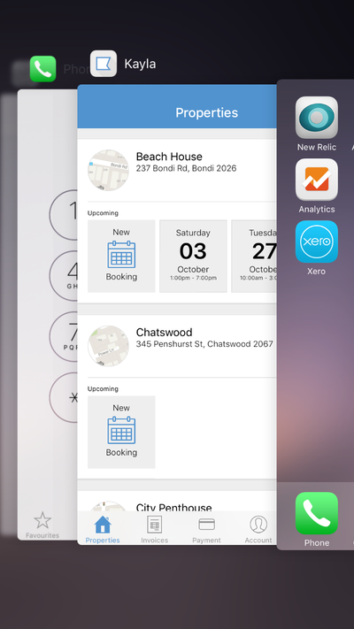
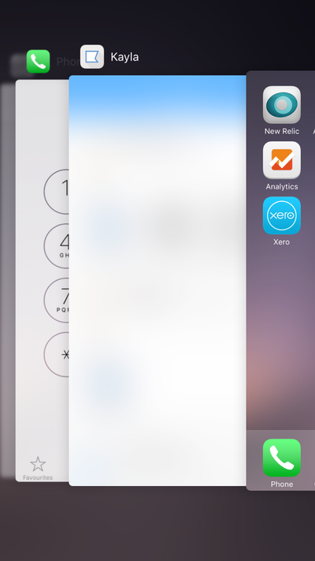

# Enable privacy snapshot for React Native

In the [App Programming Guide for iOS](https://developer.apple.com/library/ios/documentation/iPhone/Conceptual/iPhoneOSProgrammingGuide/BackgroundExecution/BackgroundExecution.html#//apple_ref/doc/uid/TP40007072-CH4-SW8), Apple says:

> When an app transitions to the background, the system takes a snapshot of the app’s main window, which it then presents briefly when transitioning your app back to the foreground. Before returning from your `applicationDidEnterBackground:` method, you should hide or obscure passwords and other sensitive personal information that might be captured as part of the snapshot.

This react-native module obscure passwords and other sensitive personal information when an app transitions to the background.

### `PrivacySnapshot.enabled(false)`



### `PrivacySnapshot.enabled(true)`



## Installation iOS

1. Run `npm install react-native-privacy-snapshot --save` in your project directory
1. Open your project in XCode, right click on `Libraries` and click `Add Files to "Your Project Name"`
1. Within `node_modules`, find `react-native-privacy-snapshot` and add RCTPrivacySnapshot.xcodeproj to your project.
1. Add `libRTCPrivacySnapshot.a` to `Build Phases -> Link Binary With Libraries`

## Usage

``` javascript
let PrivacySnapshot = require('react-native-privacy-snapshot');

...

  componentWillMount() {
    PrivacySnapshot.enabled(true);
  },

  componentWillUnmount() {
    PrivacySnapshot.enabled(false);
  },

```
